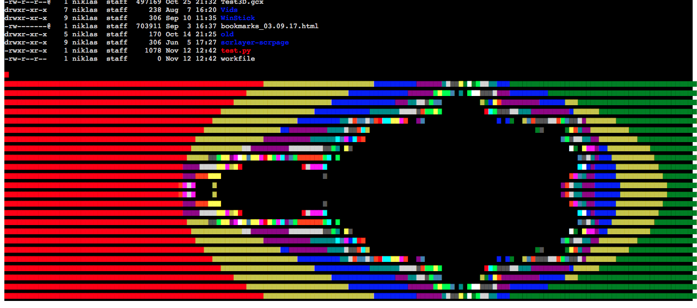

# ANSI-Escape.js

A Javascript library to render text with ANSI escape sequences using HTML and CSS.

To save a command's output into a file _with escape sequences_ use: `script -q /dev/null ls -alG > file.log`.

## Usage

```javascript
// Function signature:
function ansiToHTML(input, /*defaultFG, defaultBG*/){
    return parsedHTMLCode;
}

const cmdOutput = "... some text with escape sequences";
const parsedOutput = ansiToHTML(cmdOutput);
document.querySelector("code > pre").innerHTML = parsedOutput;
```

## Supported features

- **color**: 8/16 mode
- **style**: bold/underlined/hidden
- corresponding reset codes

Not (yet) supported:

- **color**: 88/256 mode
- **style**: blink/dim/reversed
- (unsupported codes are also logged to the console)

For detailed information see the `ANSI` object in [ANSI-Escape.js](ANSI-Escape.js).


